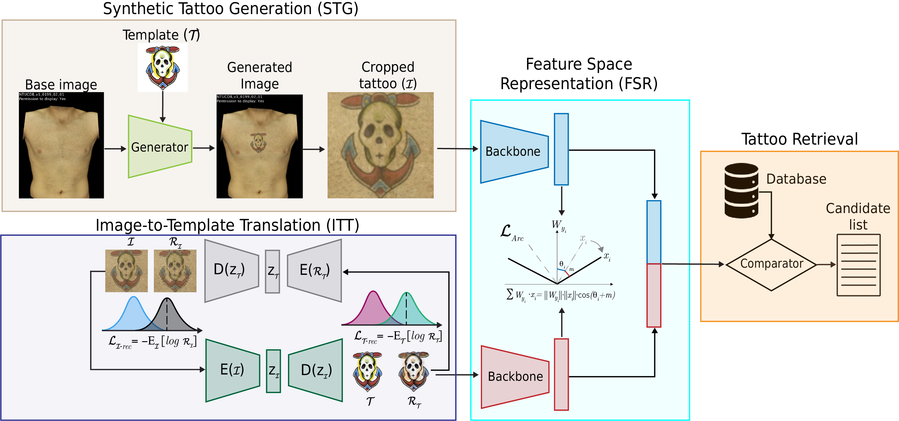

#### This is the official repository of the paper:
### TattTRN: Template Reconstruction Network for Tattoo Retrieval
### Paper accepted at [CVPR 2024 Biometrics Workshop](https://www.vislab.ucr.edu/Biometrics2024/index.php)

 

<hr/>

## Requierements ##
- Python 3.8+
- pytorch-lightning==2.1.0
- torch==2.1.0
- pyeer

<hr/>

## TattTRN training ##
1. Ask for the semi-synthetic database for tattoo retrieval to lazaro-janier.gonzalez-soler@h-da.de or christian.rathgeb@h-da.de under the subject HDA-Tattoo-Retrieval.
2. run: python train.py --root_path . --data_dir path-to-synthetic_data --images_dir Images --templates_dir Tattoo_templates --runs_dir runs_dual --num_workers 7 --max_epochs 100 --val_split 0.2 --M 0.1 --L 4 --backbone efficientnet_v2_s --num_features 512 --val_freq 10 --batch_size 64

<hr/>

## TattTRN testing ##
1. Download Webtattoo or BIVTatt.
2. Organise the database in the following format:
---- Database (BIVTatt or Webtattoo)
--------Tattoo-ID-1
----------- image1.jpg
----------- image2.jpg
--------Tattoo-ID-2
----------- image3.jpg
----------- image4.jpg
...
--------Tattoo-ID-N
----------- images...jpg
----------- image....jpg

2. run: python test.py --images_dir image-folder --output_dir output-folder --checkpoint_folder path-to-checkpoint --backbone efficientnet_v2_s --csv_file path-to-csv --num_features 512 --M 0.1

<hr/>

## Pre-trained Models ##

Pre-trained models can be found in ./models 

<hr/>

## Citation ##
If you use any of the code provided in this repository or the models provided, please cite the following paper:
```
@InProceedings{GonzalezSoler-TattTRN-CVPRW-2024,
    author    = {L. Gonzalez-Soler and M. Salwowski and C. Rathgeb and Daniel Fischer},
    title     = {TattTRN: Template Reconstruction Network for Tattoo Retrieval},
    booktitle = {Proc. IEEE/CVF Conf. on Computer Vision and Pattern Recognition (CVPR)},
    month     = {June},
    year      = {2024},
    pages     = {}
}
```